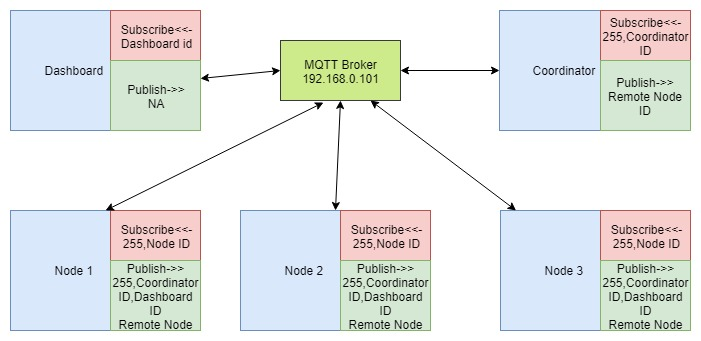
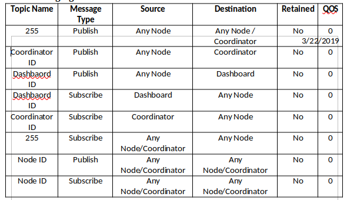

# Demonstration of Resource Sharing using Greedy algorithm over Wireless network(Wi-Fi)

## 1. Introduction 
With electrification in automotive domain, public charger like resource sharing is a real-time problem. The implemented project can be modified to serve for any such resource sharing application over a network. The project explains a noble approach of resource sharing (charger) among electric vehicles in a local network. The proposed system does not rely on any central server for request processing, a network negotiation algorithm takes care of the request queue. MQTT protocol is used to implement the network where negotiation is taking place. Each node broadcasts a message to the network and waits for a denial request, if no remote node denies the broadcast by replying to the sender, the sensor sends charging request to the coordinator. The coordinator replies to the sender with positive acknowledgement if the coordinator is free else the sender node waits in a network queue for charging. NodeX (X =1, 2, 3…N) represents a telemetry device attached with an electric vehicle which requires charging. Coordinator represents a telemetry device with a charging station, ready to serve any nodes requesting for charging. The NodeX and coordinator functionality are implemented in online mbed ide (mbed, 2015). The used mbed RTOS (Real Time Operating System) version is 2.0. To provide network access to the NodeX and coordinator, a co-microcontroller (ESP12) is integrated using UART (Universal Asynchronous Receiver Transmitter). The ESP12 development board is programmed using Arduino IDE and wifi MQTT stack is implemented in a no-rtos environment.

## 2. Description of Roles
  -  NodeX hardware design and development.
     - Each Node consist of sensors (Voltage, Current and temperature) and output devices (LED/buzzer). The hardware schematic design (Easyada, 2014) and soldering on general purpose PCB was done in this scope of the project.
  -  NodeX software design and development. 
     - Enabling CAN for STM32F407X development board. The CAN stack is working for one to one communication but does not compile with mbed rtos thread, hence CAN stack is not implemented in final version.
     - Design and development of a network negotiation algorithm to acquire charger, running on top of MQTT protocol.
     - Synchronization of threads and passing message between threads using queue.
     - Implementation of non-blocking loop
  -  Coordinator hardware design and development.
     - Wiring of OLED display with STM32F407.
  -  Coordinator software design and development.
     - Integration of SD1306 OLED display in mbed over I2C.
     - Debugging Wi-Fi to Uart Bridge with coordinator.
     - Implementation of non-blocking loop.
  -  ESP12 software design.
     - MQTT protocol implementation over Wi-Fi.
     - Self-Broadcast filter implementation. Whenever a node broadcasts, the node itself receives its own broadcast message. A filter is implemented in the mqtt callback to block self-broadcast message.
  -  MQTT broker and UI server Setup.
     - Setup of HiveMQ broker software under windows system
     - Setup of Apache2 server under windows system.
  - Design and development of UI in html
     - Design and development of bootstrapped html UI for dashboard.
     - Integration of Smoothie real-time chart with dashboard for real-time Battery SOC visualization.
     - Integration of MQTTv3.1 JavaScript client over web sockets with Dashboard.
  -  Overall Integration and testing
     - The network based negotiation algorithm testing and debugging.
     - Thread latency analysis and reduction of latency in threads.
     - Overall system testing and result analysis
     
## Architecture
  

## 3. Issues
- Issue #1: NodeX was not consistently receiving ESP12 messages over uart.
    - Solution: Node X thread had latency issues due to blocking remote objection check function, the issue is solved by implementing non-blocking loop.
- Issue #2: NodeX was not getting charger acknowledgement.
    - Solution: NodeX was receiving its own broadcast over network as NodeX has also subscribed to the broadcast topic. An ID filter implementation at ESP12 controller solved the issue
- Issue #3: NodeX was not parsing CSV properly, after 10-20 wifi message reception the buffer overflows.
    - Solution: Node X memory pool was not being cleared, hence the buffer overflow. The problem was solved by using mpool.free (message).
- Issue #4: NodeX was not able to send health information to dashboard.
    - Solution: The problem was solved by adding a Start of frame flag ($) at the starting of NodeX health message. The start of frame flag is parsed by ESP module and the message was sent to dashboard.
- Issue #5: NodeX wait for remote objection was blocking the entire Uart_to_Wifi Thread.
    - Solution: Implementation of non-blocking check function resolved the issue.
- Issue #6: Coordinator was unable to send status message to OLED.
    - Solution: Solved by clearing OLED before any display command.
- Issue #7: Coordinator button press event was not working.
    - Solution: Built-in button does not have pull up, hence the button press event was not getting registered, solved by adding an internal pull-up.
- Issue #8: NodeX ESP wifi was not transmitting MQTT broadcast messages to NodeX over UART
    - Solution: Esp transmitted data type and NodeX reception data type was not matching, solved by typecasting the received data to char.
- Issue #9: Dashboard was unable to connect to MQTT broker.
    - Solution: Dashboard websockets port and broker websockets port mismatch. Solved by changing the broker websockets port.

## 4. Future Development Scope
With electrification in automotive domain, public charger like resource sharing is a real-time problem. The implemented project can be modified to serve for any such resource sharing application over a network. Some of future amendment to the project includes
- Multiple Cost factor (Battery composition, External temperature, Battery life, Vehicle type etc.) inclusion while measuring priority of a Node.  
- Client-Server model implementation of the same problem statement.  
- Remote firmware/update feature over TCP/IP.  
- Inclusion of SSL in MQTT protocol would help increase network security metric.  
- Development of Preventive maintenance algorithm.  
- Development of user friendly dashboard, mobile app with push notification.  